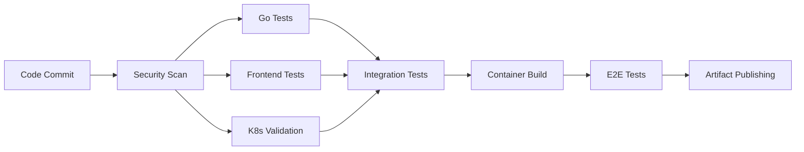
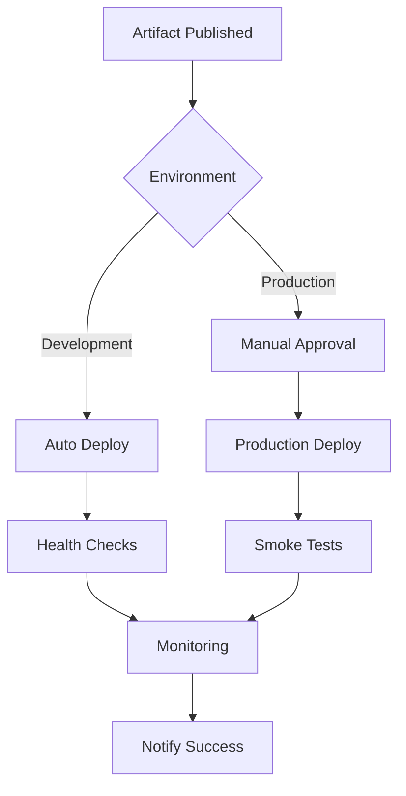

# Smart Garden Bot DevOps & Deployment Strategy Summary

## Executive Overview

The Smart Garden Bot platform implements a comprehensive DevOps strategy built on cloud-native principles, featuring GitOps-driven deployments, comprehensive monitoring, and enterprise-grade security. This document summarizes the complete deployment architecture designed for scalability, reliability, and operational excellence.

## Architecture Components

### Kubernetes Infrastructure
- **Multi-namespace Organization**: Separate namespaces for application, system components, and monitoring
- **Custom Resource Definitions**: Kubernetes-native garden management with GardenController and Sensor CRDs
- **RBAC Security**: Fine-grained permissions for operators, API servers, and applications
- **Network Policies**: Zero-trust networking with explicit ingress/egress rules
- **Resource Management**: Comprehensive HPA, resource limits, and pod disruption budgets

### Container Strategy
- **Multi-platform Builds**: AMD64 and ARM64 support via GitHub Actions
- **Security Scanning**: Trivy vulnerability scanning and Cosign image signing
- **Registry**: GitHub Container Registry with automated cleanup policies
- **Optimization**: Multi-stage Docker builds with distroless base images

### GitOps Implementation
- **ArgoCD-based Deployment**: Declarative application management with automated sync
- **Environment Promotion**: Structured development → staging → production pipeline
- **Configuration Management**: Environment-specific overlays with Helm values
- **Rollback Capabilities**: Automated rollback on failure with manual production approval

### Database Architecture
- **CloudNativePG**: High-availability PostgreSQL with automatic failover
- **Backup Strategy**: Automated S3 backups with 30-day retention
- **Point-in-time Recovery**: WAL-based recovery for data protection
- **Monitoring**: Comprehensive metrics with alerting on performance/availability

### Monitoring & Observability
- **Prometheus Stack**: Metrics collection with Grafana visualization
- **Log Aggregation**: Loki for centralized logging with Promtail collection
- **Distributed Tracing**: Jaeger integration for request flow analysis
- **Custom Dashboards**: Application-specific metrics and business KPIs
- **Alerting**: Multi-tier alerting with Slack/PagerDuty integration

### Security Framework
- **Identity Management**: Auth0 integration with JWT validation
- **Secret Management**: Kubernetes secrets with external secret operator
- **Network Security**: Istio service mesh with mTLS encryption
- **Certificate Management**: Automated TLS with cert-manager and Let's Encrypt
- **Vulnerability Management**: Continuous scanning and patch management

## CI/CD Pipeline Architecture

### Continuous Integration


### Continuous Deployment


### Pipeline Features
- **Multi-stage Security**: SAST, DAST, container scanning, and dependency checks
- **Quality Gates**: Code coverage, performance tests, and security compliance
- **Artifact Management**: Signed container images with SBOM generation
- **Deployment Strategies**: Blue-green deployments with canary releases
- **Rollback Automation**: Automatic rollback on health check failures

## Infrastructure as Code

### Kubernetes Manifests
```
k8s/
├── base/                    # Core Kubernetes resources
│   ├── namespace.yaml       # Namespace definitions
│   ├── postgresql-cluster.yaml  # Database cluster
│   ├── network-policies.yaml   # Security policies
│   ├── certificates.yaml   # TLS certificate management
│   ├── monitoring.yaml      # Observability stack
│   └── istio-config.yaml    # Service mesh configuration
├── crds/                    # Custom Resource Definitions
│   └── garden-controller-crd.yaml
├── rbac/                    # Role-based access control
│   └── operator-rbac.yaml
└── overlays/               # Environment-specific configs
    ├── development/
    ├── staging/
    └── production/
```

### Helm Chart Structure
```
helm/smart-garden-bot/
├── Chart.yaml              # Chart metadata
├── values.yaml             # Default configuration
├── values-development.yaml # Development overrides
├── values-production.yaml  # Production overrides
└── templates/
    ├── web-app/            # Frontend deployment
    ├── api/         # Backend API deployment
    ├── operator/           # Kubernetes operator
    ├── database/           # Database configuration
    ├── monitoring/         # Observability resources
    └── ingress/           # Traffic routing
```

### GitOps Repository Structure
```
gitops/
├── applications/           # ArgoCD applications
│   ├── infrastructure.yaml
│   ├── monitoring.yaml
│   ├── smart-garden-bot-development.yaml
│   └── smart-garden-bot-production.yaml
├── projects/              # ArgoCD projects
│   └── smart-garden-bot.yaml
└── repositories/          # Repository configurations
```

## Service Mesh Configuration

### Istio Implementation
- **Gateway Configuration**: External traffic management with SSL termination
- **Virtual Services**: Advanced routing with fault injection and retries
- **Destination Rules**: Load balancing and circuit breaker patterns
- **Security Policies**: mTLS enforcement and authorization rules
- **Observability**: Automatic metrics, logging, and tracing

### Traffic Management
- **Load Balancing**: Least connection with health-based routing
- **Circuit Breaking**: Automatic failure isolation
- **Retry Logic**: Intelligent retry with exponential backoff
- **Rate Limiting**: API protection with quota management
- **Canary Deployments**: Gradual traffic shifting for safe releases

## Disaster Recovery Strategy

### Recovery Objectives
| Component | RTO | RPO | Strategy |
|-----------|-----|-----|----------|
| API Server | 15 min | 0 | Multi-region deployment |
| Database | 30 min | 15 min | Point-in-time recovery |
| Web App | 10 min | 0 | CDN with failover |
| Operator | 20 min | 0 | Stateless recreation |

### Backup Strategy
- **Database**: Continuous WAL streaming to S3 with daily base backups
- **Configuration**: GitOps repository with version control
- **Secrets**: Encrypted backup with key rotation
- **Container Images**: Multi-registry replication

### Recovery Procedures
1. **Automated Failover**: Database and application-level redundancy
2. **Cross-region Recovery**: Complete stack recreation in alternate region
3. **Point-in-time Restoration**: Granular data recovery capabilities
4. **Communication Plan**: Stakeholder notification and status updates

## Operational Excellence

### Monitoring & Alerting
- **SLA Monitoring**: 99.9% uptime with automated escalation
- **Performance Metrics**: Response time, throughput, and error rates
- **Business Metrics**: User engagement, garden automation success rates
- **Infrastructure Health**: Resource utilization and capacity planning

### Runbook Automation
- **Incident Response**: Automated diagnosis and remediation
- **Maintenance Procedures**: Standardized operational tasks
- **Recovery Playbooks**: Step-by-step disaster recovery guides
- **Performance Tuning**: Automated optimization recommendations

### Security Operations
- **Vulnerability Management**: Continuous scanning and patch automation
- **Compliance Monitoring**: SOC2, PCI DSS, and GDPR adherence
- **Audit Logging**: Comprehensive activity tracking
- **Incident Response**: Security breach detection and containment

## Cost Optimization

### Resource Efficiency
- **Horizontal Pod Autoscaling**: Dynamic scaling based on demand
- **Vertical Pod Autoscaling**: Right-sizing resource allocations
- **Cluster Autoscaling**: Node management for cost optimization
- **Spot Instance Integration**: Cost reduction with fault tolerance

### Monitoring & Analysis
- **Cost Allocation**: Per-service cost tracking and allocation
- **Usage Analytics**: Resource utilization optimization
- **Rightsizing Recommendations**: ML-driven resource optimization
- **Reserved Capacity**: Long-term cost commitments for stable workloads

## Technology Stack Summary

### Core Technologies
- **Container Orchestration**: Kubernetes 1.28+
- **Service Mesh**: Istio 1.19+
- **Database**: PostgreSQL 15 with CloudNativePG
- **Message Queue**: Redis 7.0 with high availability
- **Load Balancer**: NGINX Ingress Controller

### DevOps Tools
- **CI/CD**: GitHub Actions with self-hosted runners
- **GitOps**: ArgoCD with multi-cluster management
- **Package Management**: Helm 3.13+
- **Secret Management**: External Secrets Operator
- **Certificate Management**: cert-manager with Let's Encrypt

### Observability Stack
- **Metrics**: Prometheus with Grafana dashboards
- **Logging**: Loki with Promtail collection
- **Tracing**: Jaeger with OpenTelemetry
- **Alerting**: AlertManager with multi-channel notifications

### Security Tools
- **Container Scanning**: Trivy with policy enforcement
- **Code Analysis**: SonarQube with quality gates
- **Image Signing**: Cosign with keyless signing
- **Policy Engine**: Open Policy Agent with Gatekeeper

## Performance Characteristics

### Scalability Targets
- **API Throughput**: 10,000 requests/second
- **Database Connections**: 1,000 concurrent connections
- **Garden Controllers**: 100,000 managed gardens
- **Sensor Data**: 1M data points/hour ingestion

### Reliability Metrics
- **Availability**: 99.9% uptime (8.77 hours/year downtime)
- **Error Rate**: <0.1% for critical operations
- **Recovery Time**: <30 minutes for major incidents
- **Data Durability**: 99.999999999% (11 9's)

## Implementation Timeline

### Phase 1: Foundation (Weeks 1-2)
- Kubernetes cluster setup
- Core infrastructure components
- CI/CD pipeline implementation
- Basic monitoring deployment

### Phase 2: Application Deployment (Weeks 3-4)
- Application stack deployment
- Database cluster setup
- Service mesh configuration
- Security policy implementation

### Phase 3: Observability (Weeks 5-6)
- Comprehensive monitoring setup
- Log aggregation implementation
- Alerting configuration
- Dashboard creation

### Phase 4: Production Hardening (Weeks 7-8)
- Security audit and hardening
- Performance optimization
- Disaster recovery testing
- Documentation completion

## Conclusion

The Smart Garden Bot DevOps strategy provides a robust, scalable, and maintainable platform built on cloud-native principles. The implementation ensures high availability, security, and operational excellence while maintaining cost efficiency and development velocity.

Key benefits include:
- **Automated Operations**: Reduced manual intervention through comprehensive automation
- **Rapid Recovery**: Quick incident response with automated failover capabilities
- **Scalable Architecture**: Dynamic scaling to handle growth and demand fluctuations
- **Security-First Design**: Comprehensive security controls and compliance measures
- **Operational Visibility**: Complete observability across all system components

This architecture positions the Smart Garden Bot platform for successful operation at scale while maintaining the flexibility to evolve with changing requirements and technology advances.